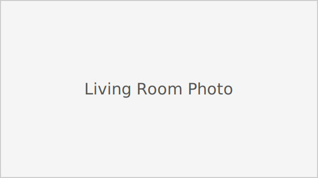
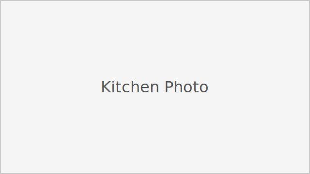
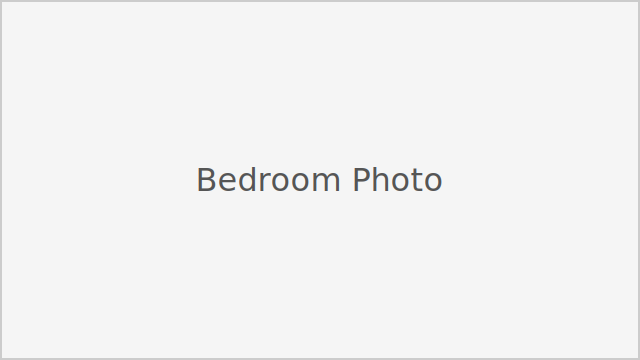
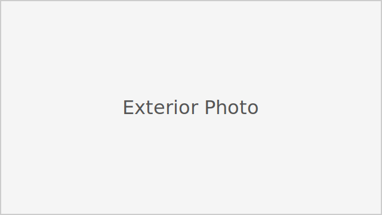

# Sunny 3BD Retreat Near CU – Great Winter Rates

> All bookings, messaging, and payments are handled securely through Airbnb.  
> This page is just an easy way to see details and photos in one place.

[:material-airbnb: View listing on Airbnb](https://www.airbnb.com/rooms/1529214807731831639){ .md-button .md-button--primary target="_blank" }

---

## QR Pages

A couple of QR-friendly pages guests can use on the go:

- [Inside the Fox Den](house.md) – quick links to guest guides and checklists.
- [Around Boulder](boulder.md) – mobile notes for getting around and exploring.

---

## Overview

This sunny three-bedroom home in Boulder is a comfortable base for trips to **CU Boulder**, downtown, and the nearby foothills. The layout works well for small groups, visiting family, and longer work trips.

- **3 bedrooms · 2 bathrooms**
- **Fast Wi-Fi and a work-friendly setup**
- **Quiet neighborhood** with easy access to campus and trailheads

The main living area gets plenty of natural light during the day, with seating for hanging out, reading, or getting some laptop time in before you head out.

---

## Highlights

- **Bright, open living space** – Large windows and comfortable furniture make it a relaxing place to start and end your day.
- **Cook-ready kitchen** – Full kitchen with modern appliances and the basics you need to make meals at home.
- **Work-from-Boulder friendly** – Fast Wi-Fi and a small workspace area for calls and emails.
- **Convenient but quiet** – Close to CU Boulder and downtown, without giving up a calm neighborhood feel.

---

## Sleeping arrangements

> Adjust this section textically if your exact bed layout is different.

- **Bedroom 1** – Queen bed · closet space · good natural light  
- **Bedroom 2** – Queen bed · dresser · located in a quieter part of the house  
- **Bedroom 3** – Flexible setup (e.g., twin beds or office/guest combo), good for kids or mixed groups

Each room has fresh linens, pillows, and space to unpack so you don’t have to live out of a suitcase the whole time.

---

## Amenities

Core amenities (match these to your Airbnb listing):

- Fast Wi-Fi  
- Dedicated workspace / desk area  
- Full kitchen with modern appliances  
- Coffee maker & kettle  
- Washer & dryer  
- Heating  
- Linens and towels provided  
- Basic cooking supplies (oil, salt, pepper, etc.)  
- Free street or driveway parking  
- Self check-in (keypad or lockbox)  

If you add or remove amenities in the Airbnb listing, update this list to match.

---

## Photos

This site is built with MkDocs Material, which expects images to live under `docs/assets/`.

You can add your own photos as follows:

1. Put your images in `docs/assets/` (for example:
   `docs/assets/living-room.jpg`, `docs/assets/kitchen.jpg`, `docs/assets/bedroom.jpg`, `docs/assets/exterior.jpg`).
   The repository ships with lightweight SVG placeholders that you can swap out whenever you have your own JPEGs.
2. Update the image references below so the filenames match what you upload.

Example layout (you can adjust captions as you like):

{ width=100% }

{ width=49% }
{ width=49% }

{ width=100% }

If you don’t have images yet, these placeholders will simply not render until the files exist.

---

## Location

**Boulder, Colorado – near CU Boulder campus and foothills trails**

The home is in a Boulder neighborhood that makes it easy to get to:

- CU Boulder campus  
- Downtown Boulder restaurants and shops  
- Nearby trailheads and open space  

Exact address and arrival details are shared after booking through Airbnb.

> If you’d like, you can embed a simple map here by pasting an iframe snippet from Google Maps.  
> MkDocs will render raw HTML in Markdown, so a `<iframe>` embed is allowed.

---

## House rules & good to know

> Make sure these align with the rules on your Airbnb listing.

- Check-in and check-out times follow the Airbnb listing.  
- No parties or large events.  
- No smoking inside the home.  
- Pets only if approved in advance.  
- Please respect neighbors and quiet hours.  

Full, up-to-date rules, cancellation policies, and any fees are always listed on the Airbnb page itself.

---

## Booking & contact

All reservations, cancellations, and messaging go through Airbnb.

[:material-airbnb: Check availability & book on Airbnb](https://www.airbnb.com/rooms/1529214807731831639){ .md-button .md-button--primary target="_blank" }

[:material-email: Message the host on Airbnb](https://www.airbnb.com/rooms/1529214807731831639){ .md-button target="_blank" }

If any pricing or rules on this page ever conflict with Airbnb, the Airbnb listing is the source of truth.

---
